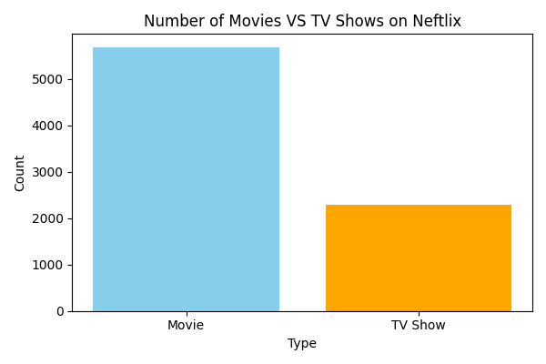
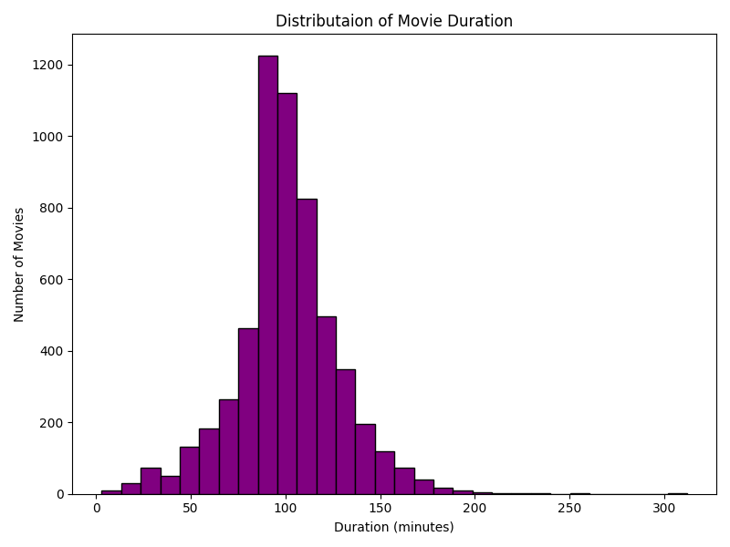
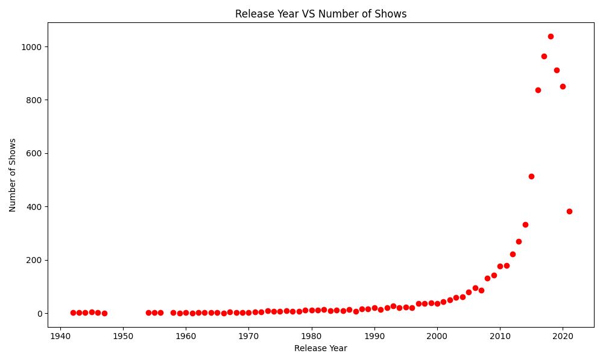
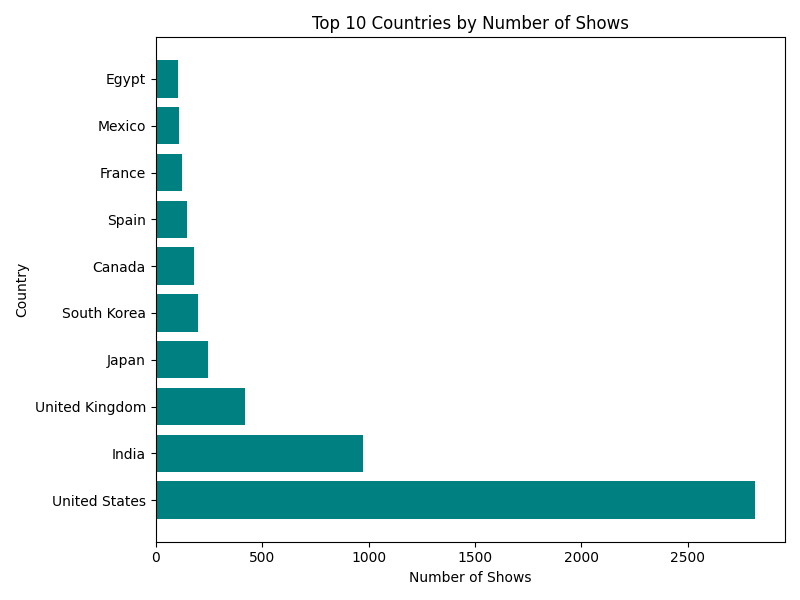
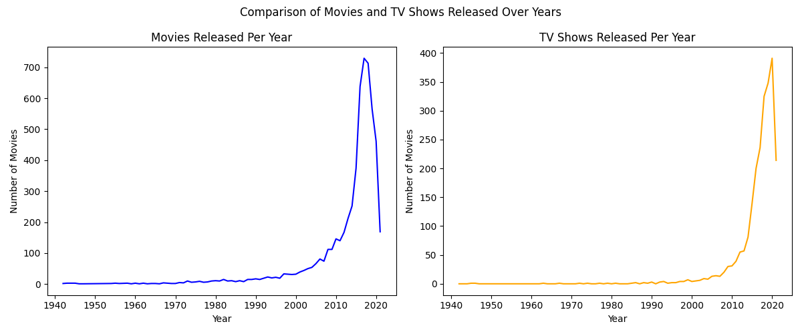

# 🎬 Netflix Data Analysis Project

Exploring Netflix dataset using Python, Pandas & Matplotlib.

---

## 📈 Visual Insights

### 🎥 Movies vs TV Shows

### 🍿 Content Ratings Distribution

### ⏱️ Movie Duration Distribution

### 📆 Releases Over the Years

### 🌍 Top 10 Countries by Content Count

### 📉📈 Comparison of  Number of  TV shows between Movies released over the Years

---

## 🧠 Tools Used
Python | Pandas | Matplotlib | Jupyter Notebook

## 📊 Dataset
Netflix Titles [netflix_titles.csv](https://github.com/user-attachments/files/23050858/netflix_titles.csv)
Dataset (Kaggle)

